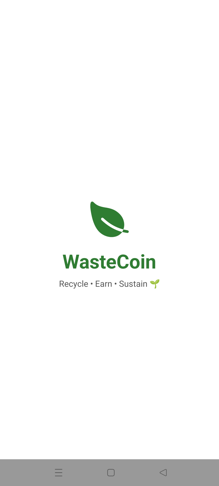
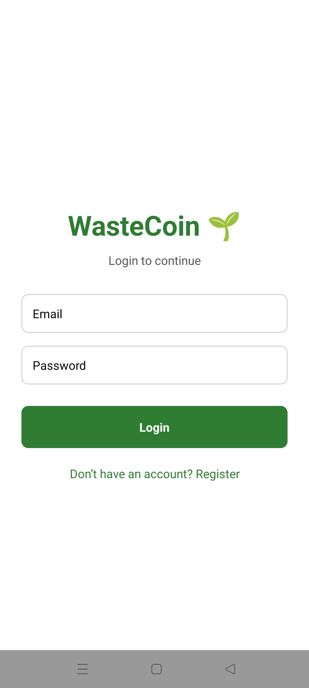
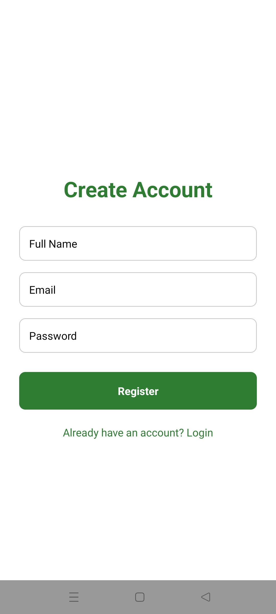
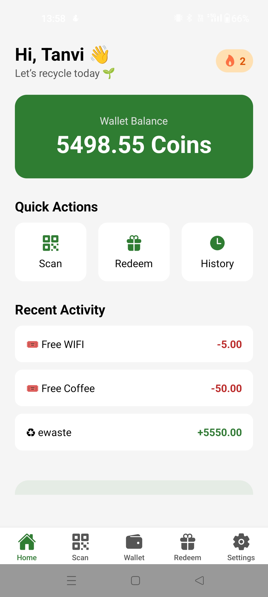
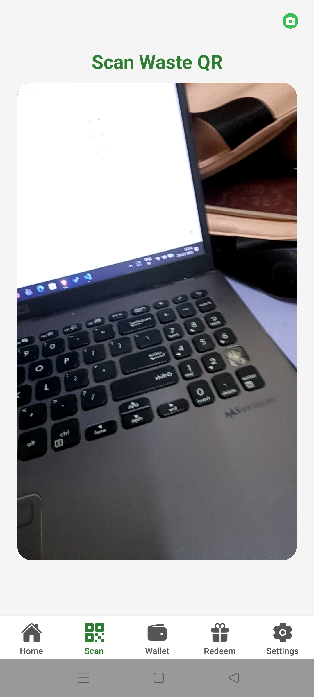
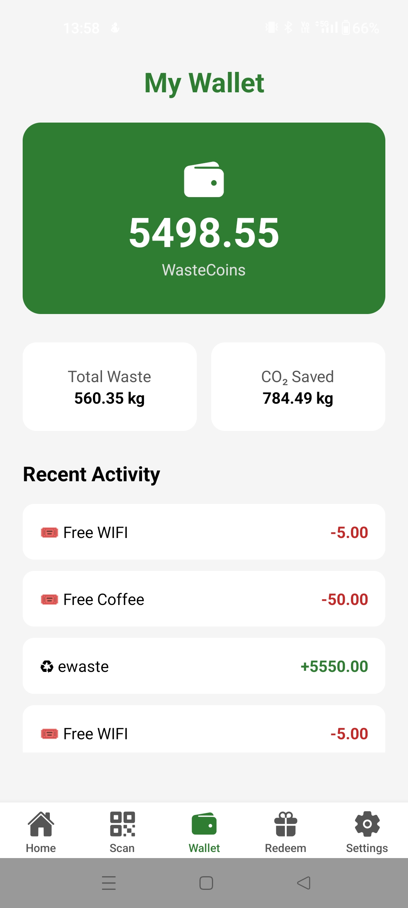
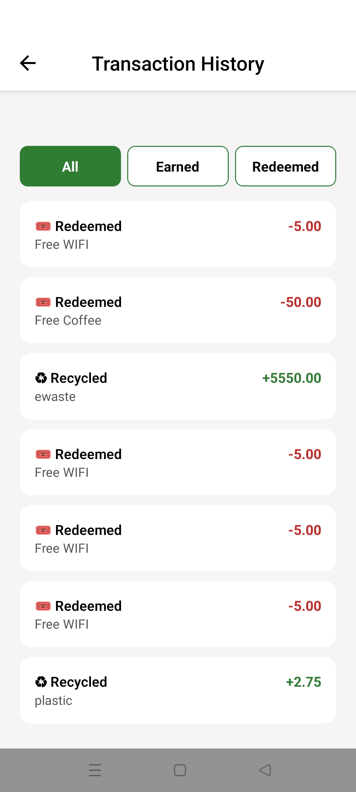
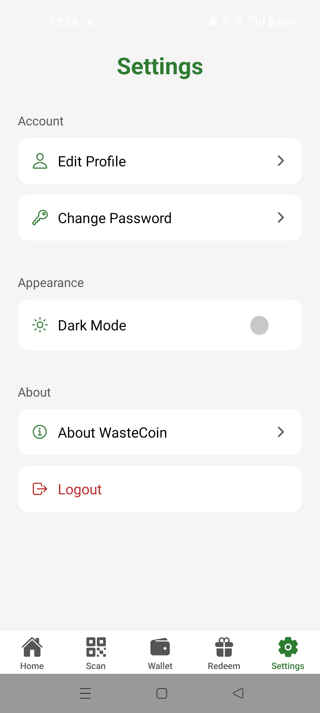
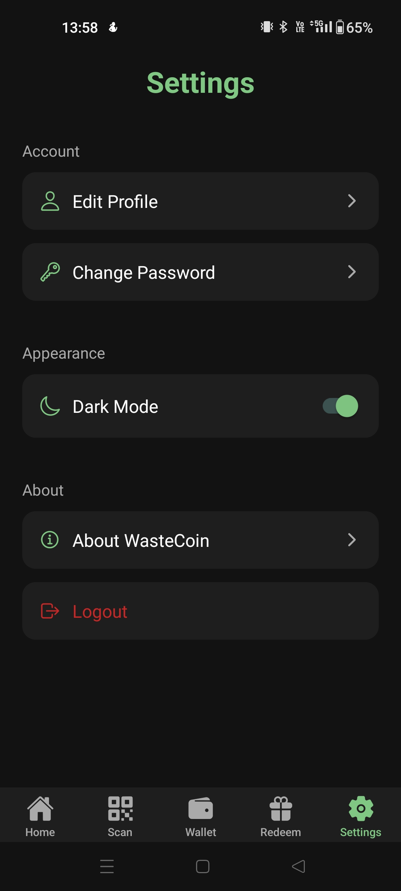

# ♻️ WasteCoin — Incentive-Driven Smart Recycling App

WasteCoin is a **mobile-based sustainability rewards application** designed to **bridge the gap between smart waste infrastructure and real human behavior**.

Today, **smart waste bins already exist** — ranging from **IoT-enabled bins**, **AI-based waste segregation systems**, to **sensor-driven disposal units** used in smart cities, campuses, and commercial spaces.  
However, **technology alone has not been enough to convince people to recycle consistently**.

🚨 **The real problem is not availability — it’s motivation.**

WasteCoin introduces an **incentive-based behavioral layer** on top of existing smart waste systems.  
By integrating **QR codes generated by smart bins or waste disposal points**, users can **scan, earn rewards, and track their environmental impact**, making recycling a **habit rather than a chore**.

This approach helps:
- Encourage **daily usage** of smart waste bins
- Increase **public participation** in recycling programs
- Transform recycling into a **reward-driven lifestyle choice**

---

## 🚀 Key Features

### 🏠 Dashboard
- Personalized user greeting
- Live wallet balance
- Recent activity
- Environmental impact metrics:
  - Total waste recycled (kg)
  - CO₂ saved
- Quick actions for Scan, Redeem, and History

### 📷 Scan & Earn
- Scan QR codes generated by **smart waste bins**
- Earn WasteCoins based on **material type and weight**
- One-time QR validation to prevent misuse
- Instant wallet updates

### 🎁 Redeem Rewards
- Redeem WasteCoins for partner brand rewards
- Automatic insufficient balance handling
- Secure redemption tracking

### 💼 Wallet & History
- Real-time wallet balance
- Earn and redeem transaction history
- Waste contribution and CO₂ savings summary

### ⚙️ Settings
- Edit user profile 
- Theme support (Light / Dark)
- About Us
- Secure logout

---

## 🔐 Authentication & Security

- Firebase Authentication (Email & Password)
- Cloud Firestore security rules
- One-time QR scan enforcement
- Server-side timestamps for all transactions

---

## 🛠️ Tech Stack

- **React Native (Expo)** – Mobile app development
- **Expo Camera** – QR code scanning
- **Firebase Authentication** – User login & security
- **Cloud Firestore** – Real-time database
- **Context API** – Global state management
- **React Navigation** – App navigation
- **EAS Build** – Android & iOS builds

---

## 📦 Data Model Overview

- **Users** — Wallet balance, waste stats, scan history  
- **Transactions** — QR scans, waste type, weight, coins earned  
- **Coupons** — Reward value, brand, validity  
- **Brands** — Partner details for rewards

---

## 📸 Screenshots

### 🌀 Splash Screen  

### 🔐 Login  

### 📝 Register  

### 🏠 Dashboard  

### 📷 Scan QR  

### 💼 Wallet  

### 📜 History  

### 🎁 Redeem Rewards  

### ⚙️ Settings  

### 🌗 Light / Dark Theme

---

## 📬 How It Works

1. Smart waste bins generate QR codes after waste disposal
2. Users scan the QR code using WasteCoin
3. System calculates earned WasteCoins
4. Wallet and environmental stats are updated
5. Coins can be redeemed for rewards

---

## 🌱 Environmental Impact

WasteCoin helps users:
- Build **daily recycling habits**
- Understand their **real-world CO₂ savings**
- Actively participate in smart city waste systems
- Stay motivated through rewards and feedback

---

## 📌 Future Enhancements

- Direct IoT bin integration (auto QR generation)
- Leaderboards and achievement badges
- Admin dashboard for city/brand partners
- Push notifications and streak reminders
- AI-based waste validation

---

## 👩‍💻 Author

<table>
  <tr>
    <td align="center">
      <b>Tanvi Khare</b> 
      
      
    </td>
  </tr>
</table>

---

## 📄 License

This project is licensed under the MIT License. See the `LICENSE` file for more details.
